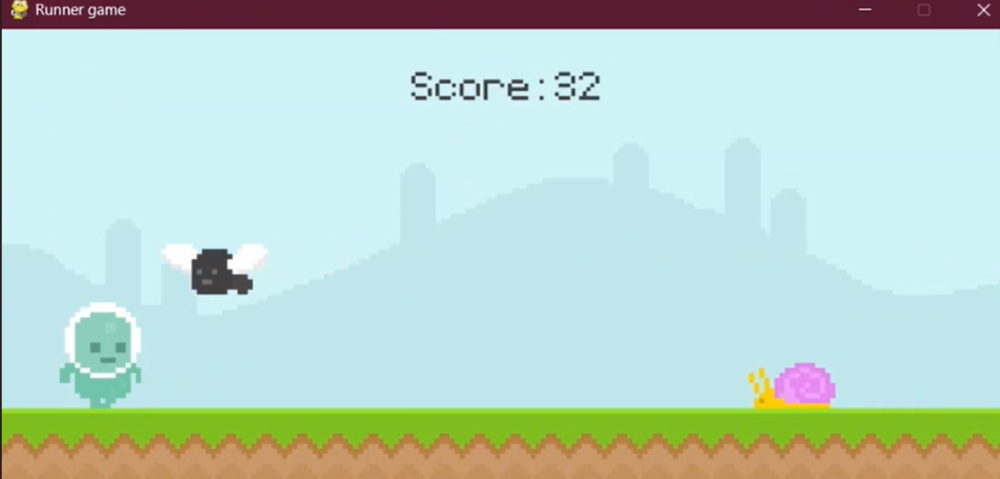

# 🎮 Runner Game com Pygame

Este projeto é um **jogo estilo endless runner** desenvolvido em **Python utilizando a biblioteca Pygame**. O objetivo é simples: controlar o personagem, desviar dos obstáculos e sobreviver o máximo de tempo possível para aumentar sua pontuação.

---

## 🚀 Demonstração

---

## 🧠 Sobre o projeto

Este projeto foi desenvolvido com o objetivo de praticar conceitos fundamentais de programação e desenvolvimento de jogos, como:

- Estrutura de um game loop
- Manipulação de eventos (teclado e mouse)
- Sistema de colisão
- Animação com sprites
- Controle de física (gravidade e pulo)
- Sistema de pontuação baseado em tempo
- Organização de código com funções
- Uso de **list comprehension** para otimização e limpeza da lista de obstáculos

---

## 🎯 Funcionalidades

- Movimento do personagem com pulo
- Obstáculos dinâmicos (snail e fly)
- Sistema de pontuação progressiva
- Tela inicial e tela de game over
- Animações de personagem e inimigos
- Spawn automático de obstáculos com timers

---

## 🛠️ Tecnologias utilizadas

- Python
- Pygame

---
## 📚 Referência
Este projeto foi desenvolvido com base em um vídeo de introdução ao Pygame no YouTube, sendo adaptado e modificado para reforçar o aprendizado e explorar novas funcionalidades.
